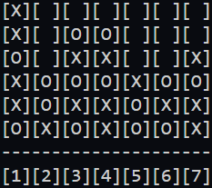

# Connect-4 Neural Network Opponent

This python repository contains a full text-based connect 4 game and a basic AI opponent for single player gameplay. The data used to train the model was created by simulating 5000 random games of connect 4, the code for which can be found in the `training` folder. The model was created using Tensorflow and can be used to play against a human or another bot. 

|  |
|:--:| 
| *An example board from the game.* |
